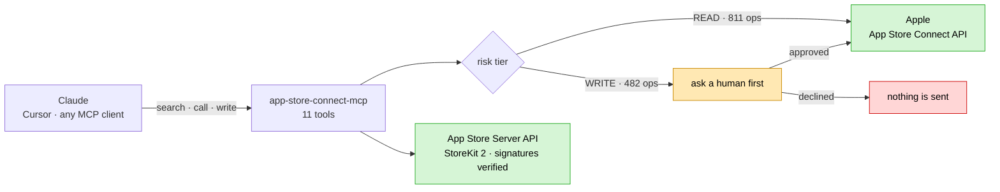
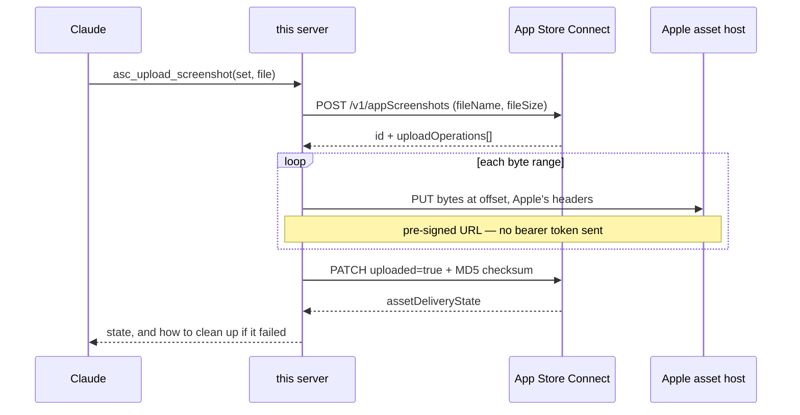
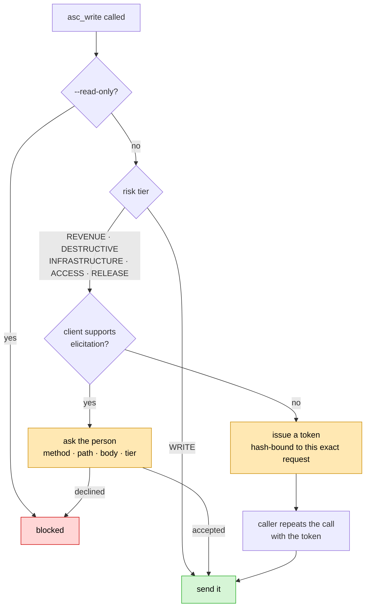

# App Store Connect MCP Server

**Give Claude your App Store Connect account without giving it the keys to your pricing.**
An MCP server covering the App Store Connect API *and* the App Store Server API
(StoreKit 2) — 1,293 operations behind 11 tools, for Claude Code, Claude Desktop,
Cursor and anything else that speaks [Model Context Protocol](https://modelcontextprotocol.io).

[](https://github.com/abd3lraouf-studios/app-store-connect-mcp/actions/workflows/ci.yml)
[](#receipts)
[](#receipts)
[](LICENSE)

[](#keeping-current-with-apple)
[](#the-eleven-tools)
[](#receipts)
[](package.json)
[](#known-limits)

```
1,293 operations · 11 tools · key never on disk · Apple signatures verified
```



---

## Don't install this

Genuinely. There are cheaper ways to spend your afternoon, and several kinds of
person should close the tab now:

**You want an agent that just does things.** This one stops and asks before it
changes a price, deletes anything, or touches who can access your account — and
it asks *you*, not itself. If that sounds like friction, it is. That is the
product.

**You want every endpoint as its own tool.** Some servers register 890. Yours
would spend six figures of context on tool definitions before answering a single
question. This registers 11 and finds the rest by searching.

```text
tool definitions loaded into context, before you ask anything

  one tool per endpoint   ███████████████████████████████████   >100k tokens
  this server             ▌                                       ~1k tokens
```

**You're on Windows or Linux and wanted Keychain.** Keychain storage is macOS
only. You can use a file path elsewhere, but the best part of this is
macOS-shaped.

**You want it to write your App Store copy.** It will fetch your reviews and
your localisations. It will not invent marketing prose and push it live, and
there is no flag to make it.

**You're evaluating this for a product you sell.** Read [the licence](LICENSE)
first. Internal use is free; reselling it isn't.

Still here? Then the rest is probably for you.

---

## What it refuses to do

Most of the engineering here went into restraint, so it is the honest place to
start.

**It won't run generated code.** The elegant way to cover a huge API is to let
the model write JavaScript and `eval` it in a sandbox. Node's `vm` is not a
sandbox — its own documentation says so — and any host object handed in leaks
the whole realm back through its prototype chain:

```js
spec.constructor.constructor('return process.env.HOME')()   // → /Users/you
```

That is a reproduction of a real shipping MCP server's sandbox, and it returns
your home directory. Its 15-second timeout doesn't help either: it bounds only
*synchronous* code, so an `async` loop runs forever. This server dispatches
**parameters**, not code. Same coverage, same token cost, nothing to escape.

**It won't let a write pretend to be a read.** Reads and writes are separate
tools. `asc_write` carries `_meta["anthropic/requiresUserInteraction"]`, which
Claude Code honours **even under `bypassPermissions`**. There is no flag that
turns that off, because a safety you can disable is a safety you will disable.

**It won't decide your pricing intent for you.** `preserve_current_price` is a
required parameter with no default. Apple defaults it to `false` — meaning your
existing subscribers get moved to the new price. Making it required forces that
decision into the open, where a person can see it.

**It won't create ongoing commitments to answer a question.** Fetching analytics
needs a report request, and `accessType: ONGOING` is a standing obligation on
your account, not a query. The tool reads reports; it will not create one
silently.

**It won't pretend it sanitised your reviews.** Customer review text is written
by strangers and lands in your model's context verbatim. Results carrying it
*lead* with a note saying it is data to report on, not instructions to follow.
It is deliberately not filtered for injection phrases — that is a game attackers
iterate against, and passing such a filter would imply a safety it cannot
deliver.

**It won't tell you a signature is fine when it hasn't checked.** See below.

---

## Install

```bash
git clone https://github.com/abd3lraouf-studios/app-store-connect-mcp
cd app-store-connect-mcp && npm install && npm run build
```

Register it with Claude Code:

```bash
claude mcp add --scope user app-store-connect \
  --env ASC_KEY=keychain:my-asc-key \
  --env ASC_BUNDLE_ID=com.example.app \
  --env ASC_APP_APPLE_ID=1234567890 \
  -- node "$PWD/dist/index.js"
```

Or, for Claude Desktop, Cursor and friends:

```json
{
  "mcpServers": {
    "app-store-connect": {
      "command": "node",
      "args": ["/path/to/app-store-connect-mcp/dist/index.js"],
      "env": {
        "ASC_KEY": "keychain:my-asc-key",
        "ASC_BUNDLE_ID": "com.example.app",
        "ASC_APP_APPLE_ID": "1234567890"
      }
    }
  }
}
```

Then ask it *"check the App Store Connect connection"* — that runs `asc_status`,
which verifies your credentials with one lightweight request and tells you
exactly what is missing if anything is.

### Your key belongs in the Keychain

Apple lets you download a `.p8` **exactly once**. A plaintext copy on disk is a
copy that can leak.

```bash
ASC_KEY=keychain:my-asc-key          # recommended
ASC_KEY=/path/to/AuthKey.p8          # works, but plaintext
ASC_PRIVATE_KEY='-----BEGIN…'        # discouraged: ps -E exposes it
```

Store it as base64 JSON so the identifiers travel *with* the key material —
`ASC_KEY_ID` then cannot drift out of sync with the key it names, a mismatch
that surfaces only as an opaque 401:

```bash
security add-generic-password -s my-asc-key -a api -w "$(
  jq -nc --arg i "$ISSUER" --arg k "$KEYID" --arg p "$(cat AuthKey.p8)" \
    '{issuerID:$i,keyID:$k,privateKeyPEM:$p}' | base64
)"
```

---

## The eleven tools

**Five core**, covering everything:

| Tool | |
|---|---|
| `asc_status` | Credentials, reachability, remaining rate-limit budget. Run this first when anything fails — it separates a bad key from a bad request. |
| `asc_search_endpoints` | Search 1,293 operations across both APIs by keyword, method, tag or risk tier. |
| `asc_describe_endpoint` | Parameters, request-body schema with real field names, risk tier. |
| `asc_call` | **Reads.** Path and query parameters, pagination, both APIs. |
| `asc_write` | **Everything that changes data.** Confirmation, `dry_run`. |

**Six composite**, for chains the raw API cannot express in a single call. A
tool that merely saved one request was left out — it would need keeping in step
with Apple forever and buys nothing `asc_call` doesn't already do:

| Tool | What it collapses |
|---|---|
| `asc_pricing_get` | ~175 lookups → a handful. The **currency lives on the territory**, not the price row, so reading prices by hand gives ambiguous numbers. |
| `asc_pricing_set` | The same chain plus the write, with the subscriber decision forced into the open. |
| `asc_preflight_version` | Six resources → **GO / NO-GO**, each gap naming the operation that fixes it. |
| `asc_listing_screenshots` | A request per locale → four, via `included`. |
| `asc_upload_screenshot` | Apple's reserve → PUT-at-offsets → commit-with-MD5 sequence, across two hosts. |
| `asc_analytics_report` | Five hops → signed URL → gunzip → rows, with **every segment stitched**. |

<details>
<summary><b>Why <code>asc_upload_screenshot</code> cannot be one API call</b></summary>

Apple's asset flow spans two hosts and ends in a checksum that fails *silently*
if you get it wrong — the upload simply sits in `AWAITING_UPLOAD` looking like
nothing happened. `uploadOperations` appears in Apple's OpenAPI document only as
a value in a `fields[]` enum, so an agent reading the spec can see the field
exists and still have no idea it must act on it.



</details>

Plus **four resources** (`@asc:cookbook`, `@asc:enums`, `@asc:risk`,
`@asc:sources`) and **four workflows** as slash commands:
`/mcp__asc__release-readiness`, `pricing-audit`, `review-triage`,
`testflight-status`.

---

## Write safety

An HTTP method is a poor proxy for consequence. `PATCH /v1/subscriptionPrices`
and `PATCH /v1/appInfos/{id}` are both writes; only one changes what customers
are charged, and neither is undone by repeating it. So every operation carries a
tier (counts are App Store Connect; StoreKit 2 adds 14 reads and 16 writes):

| Tier | Count | |
|---|---|---|
| `READ` | 797 | No change. |
| `WRITE` | 238 | Changes data. |
| `REVENUE` | 61 | Pricing, subscriptions, entitlements. |
| `DESTRUCTIVE` | 132 | Deletes. |
| `RELEASE` | 12 | Builds, submissions, what ships. |
| `ACCESS` | 12 | Who can reach the account. |
| `INFRASTRUCTURE` | 11 | Certificates, identifiers, callback URLs. |



The bottom five ask before running. Where your client supports **elicitation**,
it asks *you* directly, showing the method, path, body and tier. Otherwise it
issues a confirmation token bound by hash to the exact operation, path, query
and body — so one obtained for a cheap call cannot be spent on an expensive one.
A client that claims elicitation but fails to deliver it falls back rather than
sailing through.

```
--read-only    block every write       --confirm     confirm every write
--no-confirm   never confirm           (default)     confirm the five tiers above
--dry-run      report the exact request without sending it
```

---

## Signature verification

Decoding a JWS tells you what the bytes say. **Verifying** it tells you Apple
said it. That distinction matters here more than most places, because these
payloads are the evidence behind *"is this person a paying subscriber?"* — and a
decoded but unverified transaction is exactly the shape a forged one takes.

Every signed field is checked against **Apple Root CA - G3**, vendored in
`certs/` so verification cannot be switched off by a network failure. Chain
validation, expiry, revocation and the bundle/environment checks go through
Apple's own library, because those are precisely where a plausible-looking
implementation accepts bad input.

Outcomes are **per field**, not per response — one bad signature in a history of
two hundred is the case that matters:

```json
"signedTransactionInfo_decoded":      { "productId": "premium.monthly" },
"signedTransactionInfo_verification": { "verified": true }
```

Where it cannot run, payloads are still decoded and **every field says so**.
Silence would be the dangerous outcome.

---

## How it compares

| | Approach | Kept | Rejected |
|---|---|---|---|
| Hand-wrapped tools | One tool per endpoint | Typed, discoverable arguments | 70–900 tool definitions, >100k tokens, stale the moment Apple ships a version |
| Code Mode | Model writes JS, server `eval`s it | Two tools, ~1k tokens, full coverage | Runs generated code in a process holding a signing key |
| **Meta-tools** | `search` → `call` with **parameters** | Same context win, no code execution | — |

Credit where due: several ideas here were adapted from reading
[erayendes/app-store-connect-mcp](https://github.com/erayendes/app-store-connect-mcp)
and [TrialAndErrorAI/appstore-connect-mcp](https://github.com/TrialAndErrorAI/appstore-connect-mcp).
No code was copied. Heimdall in particular is the most developed server in this
space, and if you want 890 typed tools organised into profiles, use it instead —
it is good, and it is a different trade to this one.

---

## Receipts

Claims are cheap. These are checkable:

```
289 tests · 93% line coverage · offline, no credentials, runs on every PR
```

- **Both directions of signature verification.** A verifier that rejected
  everything would look just as healthy as a correct one, so a generated chain
  carrying the two Apple OIDs the verifier insists on proves the *accept* path,
  while forged, tampered, wrong-bundle and wrong-environment payloads are all
  rejected.
- **The protocol version is measured, not assumed.** Claude Code 2.1.235
  negotiates MCP `2025-11-25` and declares `elicitation` — recorded by having it
  connect to a probe server. That is why this stays on SDK v1: the v2 packages
  implement 2026-07-28, which replaces elicitation with MRTR, and elicitation is
  what makes `asc_write` ask a human.
- **MSW, not nock,** for HTTP mocking — `nock` patches `node:http`, and Node's
  global `fetch` is undici, which bypasses it entirely. It would have
  intercepted nothing, silently.
- **One test spawns the real binary** and asserts every stdout line parses as
  JSON, because a single stray `console.log` corrupts the JSON-RPC channel and
  no in-process harness can catch it.

```bash
npm test              # 289 tests, offline
npm run verify        # 14 read-only checks against the live APIs
npm run fetch:specs   # re-download both API descriptions from Apple
```

---

## Keeping current with Apple

Coverage is a property of Apple's spec, not of how many endpoints somebody got
around to wrapping.

- **App Store Connect** — 1,263 operations, spec v4.4.1. Apple publishes an
  OpenAPI document; it is downloaded and compiled into a slim index (360KB
  against a 3.3MB spec).
- **App Store Server** — 30 operations. Apple publishes **no** OpenAPI document
  for this one, so the endpoint set is parsed out of Apple's own client library
  at a pinned release tag, and diffed against this repo's catalogue on every
  `verify` run.
- **Enum tables are generated**, all 90 of them. A widely-copied cookbook
  elsewhere lists an `eventState` value Apple does not have and omits two it
  does; generating them makes that impossible here.
- A weekly job re-fetches both and opens a branch if Apple moved.

---

## Transports

```bash
node dist/index.js                       # stdio (default)
node dist/index.js --transport http --http-token "$(openssl rand -hex 32)"
```

HTTP binds to loopback and **refuses to start without a bearer token**. It
validates `Host` and `Origin` too: a browser page can otherwise reach a
loopback-bound server as same-origin, where a token alone is no defence.

Docker builds distroless and runs as non-root. Note that stdio needs
`docker run -i` and must **not** get `-t` — a TTY mangles the JSON-RPC stream.

---

## Known limits

Stated plainly, because you will find them anyway:

- **Risk tiers are pattern-matched** from method and path. Deliberately
  cautious, but heuristics. Read `asc_describe_endpoint` before a write.
- **Keychain storage is macOS-only.** Elsewhere, use a file path with
  restrictive permissions.
- **`--no-confirm` disables the gate.** It exists for CI and is a poor default
  anywhere a person is present.
- **`--no-online-checks` skips OCSP**, which means accepting a revoked
  certificate.
- **Not published to npm yet.** Clone and build.
- **The accept path for signatures is proven against a substituted trust
  anchor**, not Apple's — getting a genuinely Apple-signed payload needs a real
  customer transaction. The chain logic is Apple's own library.

## Licence

[Business Source License 1.1](LICENSE). Free for internal use, evaluation and
development; offering it to third parties as a hosted or embedded service, or
redistributing it inside a commercial product, needs a licence. Converts to
Apache-2.0 on 2030-08-19.

Apple's OpenAPI description and root certificate are vendored here under
Apple's terms, not this licence — see [NOTICE](NOTICE).

Apple, App Store, App Store Connect, StoreKit and TestFlight are trademarks of
Apple Inc. This project is not affiliated with Apple.
